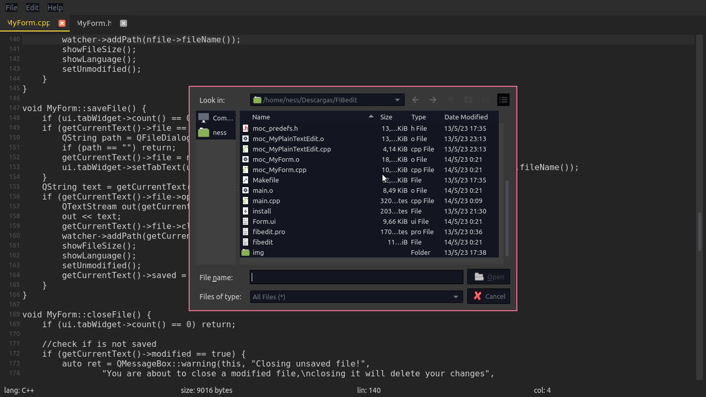

# FIBedit
#### FIB's (un)official text editor.
<br>



## Istallation
### Install Qt5
Qt5 libraries are required to compile and run fibedit.

```sh
sudo apt update
sudo apt install qt5-qmake qtbase5-dev
```

### Compile
```sh
qmake
make
```

### Execute
```sh
./fibedit
```
